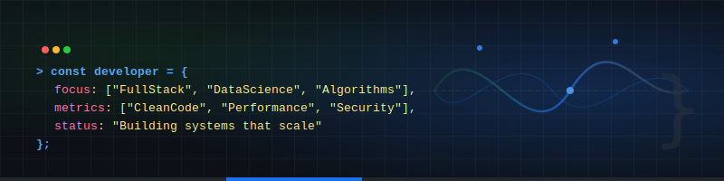
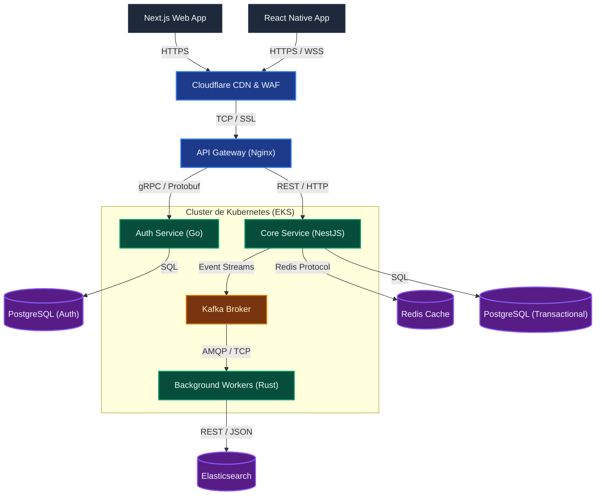

# Desarrollador de Software | Sistemas y Arquitectura

---

## Resumen Profesional
Ingeniero enfocado en el diseño e implementación de sistemas de software eficientes y scalables. Con experiencia en el desarrollo full-stack y la optimización de algoritmos complejos, priorizando la legibilidad del código, el rendimiento computacional y la solidez estructural de las bases de datos.

*   **Enfoque Actual:** Diseño de arquitecturas web distribuidas y optimización de flujos de datos.
*   **Áreas de Especialización:** Estructuras de datos, computación científica y optimización de bases de datos relacionales.
*   **Investigación y Aprendizaje:** Modelos de concurrencia y computación de alto rendimiento.

---

## Certificaciones Profesionales

### Liderazgo y Metodologías de Trabajo
*   **Software Project Leader** – Liderazgo y Gestión de Proyectos de Software, CertiProf.
*   **Framework Scrum** – Liderazgo Ágil y Eficiencia en Gestión de Proyectos.
*   **Metodologías de Resolución de Problemas** – Análisis Estructurado y Toma de Decisiones.

### Arquitectura y Desarrollo de Software
*   **Desarrollo Profesional en Elixir** – Programación Funcional, Concurrencia y Tolerancia a Fallos.
*   **Desarrollo Profesional en Java** – Arquitectura Orientada a Objetos y Desarrollo Backend.
*   **Desarrollo Profesional en Python** – Scripting, Automatización y APIs Corporativas.
*   **Desarrollo Profesional en React** – Construcción de Interfaces e Integración Frontend.
*   **Especialización en Django** – Desarrollo Ágil de Aplicaciones Web y APIs REST.

### Cloud Computing, Inteligencia Artificial y Datos
*   **Fundamentos de Microsoft Azure** – Infraestructura Cloud y Servicios en la Nube.
*   **Construcción de Apps de Inteligencia Artificial con C# y Azure** – Integración de Servicios Cognitivos y Modelos de Lenguaje.
*   **Creación de Proyectos de Ingeniería de Datos** – Modelado y Tuberías (Pipelines) de Datos.
*   **Introducción al Aprendizaje Automático (Machine Learning)** – Modelado Estadístico y Análisis Predictivo.
*   **Bases y Conceptos de Ciencia de Datos** – Análisis Exploratorio e Inferencia de Datos.

---

## Stack Tecnológico

Ecosistema técnico especializado y herramientas aplicadas en entornos de producción:

### Núcleos de Ejecución (Backend y Core)
*   **Sistemas de Alto Rendimiento:** `Go (Golang)` • `Rust` • `WebAssembly (Wasm)` • `Elixir` • `Java`
*   **Servicios Corporativos & APIs:** `Node.js (NestJS / Express)` • `Python (FastAPI / Django)`
*   **Motores de Persistencia & Caché:** `PostgreSQL` • `Redis` • `MongoDB` • `Elasticsearch`
*   **Colas & Mensajería Distribuidora:** `Apache Kafka` • `RabbitMQ`

### Interfaces y Canales (Frontend y Mobile)
*   **Aplicaciones de Servidor:** `Next.js` • `React` • `TypeScript`
*   **Desarrollo Mobile Híbrido:** `React Native` • `Expo` • `Zustand` • `Redux Toolkit`
*   **Estilos & Rendimiento Visual:** `TailwindCSS` • `CSS Modules` • `Vanilla CSS`

### Infraestructura y Operaciones (Cloud y DevOps)
*   **Orquestación & Contenedores:** `Kubernetes` • `Docker`
*   **Nube & Computación Edge:** `AWS (EC2, S3, RDS, Lambda, ECS)` • `Cloudflare Workers` • `Azure`
*   **Infraestructura como Código (IaC):** `Terraform`
*   **Automatización & Pipelines:** `GitHub Actions (CI/CD)` • `Nginx` (Proxy Inverso)

### Paradigmas e Ingeniería de Software
*   **Modelos Arquitectónicos:** `Microservicios` • `Event-Driven Architecture` • `Clean Architecture`
*   **Protocolos & Transporte:** `gRPC` • `WebSockets` • `RESTful APIs` • `GraphQL`
*   **Seguridad & Cifrado:** `OAuth2 / OIDC` • `JWT` • `HMAC` • `Zero Trust Architecture`
*   **Metodologías:** `Domain-Driven Design (DDD)` • `Test-Driven Development (TDD)` • `Clean Code`

---

## Patrón de Arquitectura de Referencia

Este diagrama representa el diseño del sistema que utilizo como referencia para construir aplicaciones modernas, escalables y seguras en la nube:

### Funcionamiento de la Arquitectura

*   **Ingreso de Peticiones y Seguridad Perimetral:** El tráfico proveniente de la web y dispositivos móviles pasa inicialmente por Cloudflare CDN y WAF para mitigar ataques DDoS y servir recursos estáticos almacenados en caché. Posteriormente, es recibido por un API Gateway basado en Nginx que actúa como balanceador de carga y punto único de acceso a la red interna.
*   **Autenticación Desacoplada (Low-Latency):** Las solicitudes de validación de identidad se delegan al microservicio de autenticación escrito en Go, utilizando comunicación remota gRPC sobre HTTP/2 y serialización con Protocol Buffers. Esto reduce significativamente los tiempos de procesamiento en comparación con las APIs tradicionales basadas en JSON/REST.
*   **Procesamiento Asíncrono de Eventos:** El servicio principal Core (NestJS) interactúa directamente con bases de datos relacionales PostgreSQL en una topología de replicación para alta disponibilidad. Para evitar cuellos de botella al procesar tareas pesadas o reportes gubernamentales complejos, el Core emite eventos de dominio hacia Apache Kafka.
*   **Cómputo en Segundo Plano de Alto Rendimiento:** Workers desarrollados en Rust se suscriben a las colas de Kafka para procesar las tareas asíncronas de manera concurrente con un consumo mínimo de memoria RAM, indexando finalmente la información en Elasticsearch para consultas de búsqueda de texto completo rápidas.

---

## Proyectos Seleccionados

### ERP del Gobierno
> **Desafío técnico:** Consistencia de datos distribuidos, auditoría transaccional estricta y modularización de procesos gubernamentales masivos.
*   **Descripción:** Sistema de planificación de recursos empresariales (ERP) para la administración pública, enfocado en la transparencia y gestión presupuestaria estatal.
*   **Solución:** Diseño de una arquitectura modular basada en microservicios con trazas de auditoría inmutables en base de datos PostgreSQL, garantizando la consistencia eventual entre módulos financieros y de inventario.
*   **Tecnologías:** Node.js, Express, PostgreSQL, Docker.

### App Billetera
> **Desafío técnico:** Seguridad a nivel de almacenamiento local/remoto y prevención de condiciones de carrera en transferencias monetarias concurrentes.
*   **Descripción:** Plataforma de billetera digital y pagos electrónicos transaccionales en tiempo real.
*   **Solución:** Diseño de un libro contable (ledger) inmutable con aislamiento de transacciones de base de datos a nivel "Serializable" para evitar colisiones y dobles gastos, utilizando caché en memoria para validaciones de saldo rápidas.
*   **Tecnologías:** Node.js, PostgreSQL, Redis, WebSockets.

### App Wendelyn
> **Desafío técnico:** Sincronización "offline-first" de datos locales y optimización del rendimiento en dispositivos de gama media-baja.
*   **Descripción:** Aplicación móvil híbrida para la gestión operativa y de flujos de trabajo en campo.
*   **Solución:** Implementación de persistencia local mediante base de datos integrada con un motor de sincronización personalizado y resolución automática de conflictos al reestablecer la conexión con el servidor.
*   **Tecnologías:** React Native, TypeScript, SQLite.

### Luceete
> **Desafío técnico:** Renderizado dinámico de alto rendimiento para portafolios interactivos con alta carga visual y optimización de SEO.
*   **Descripción:** Plataforma web interactiva para el descubrimiento de portafolios de creativos y creadores de contenido.
*   **Solución:** Implementación de Generación Estática Incremental (ISR) en servidor periférico (Edge Rendering) junto con almacenamiento CDN para reducir el tiempo de carga del primer byte (TTFB) a menos de 100ms.
*   **Tecnologías:** Next.js, React, Cloudflare CDN.

### [un-aporte-matematico](https://github.com/Kev287mejia/un-aporte-matematico)
> **Desafío técnico:** Implementación de transformaciones afines bidimensionales y mitigación de errores de redondeo aritmético en JavaScript.
*   **Descripción:** Biblioteca modular para el análisis numérico, visualización de funciones y rotación afín de vectores en un plano 2D.
*   **Solución:** Diseño de un motor algebraico con tolerancia numérica de precisión simple ($10^{-10}$) para neutralizar imprecisiones aritméticas en punto flotante e implementación de una suite automatizada de pruebas unitarias.
*   **Tecnologías:** JavaScript (ES6 Modules), Node.js.

---

## Contacto

*   **Email:** [Kevinomarmejia97@gmail.com](mailto:Kevinomarmejia97@gmail.com)
*   **GitHub:** [@Kev287mejia](https://github.com/Kev287mejia)
